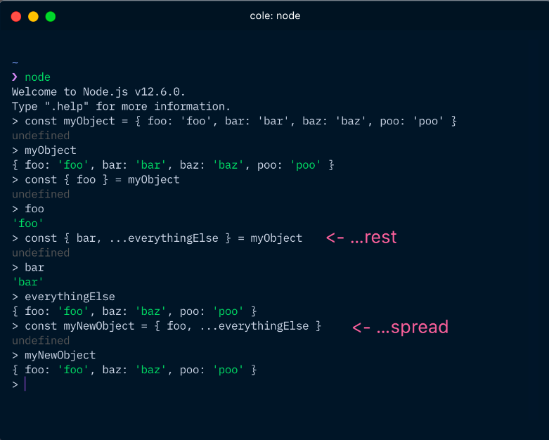

# Rest and Spread

  

credit: [@colepeters](https://github.com/colepeters)

## Use spread operator to avoid mutating objects (i.e. shallow copying)

```
const a = { name: 'Joe' };
const b = { ...a };
b.name = 'Jane';
console.log(b); // { name: "Jane" }
console.log(a); // { name: "Joe" }
```

👆 This works on objects of single-level depth. 
 

[Source](https://nick.scialli.me/object-assignment-for-beginners/)